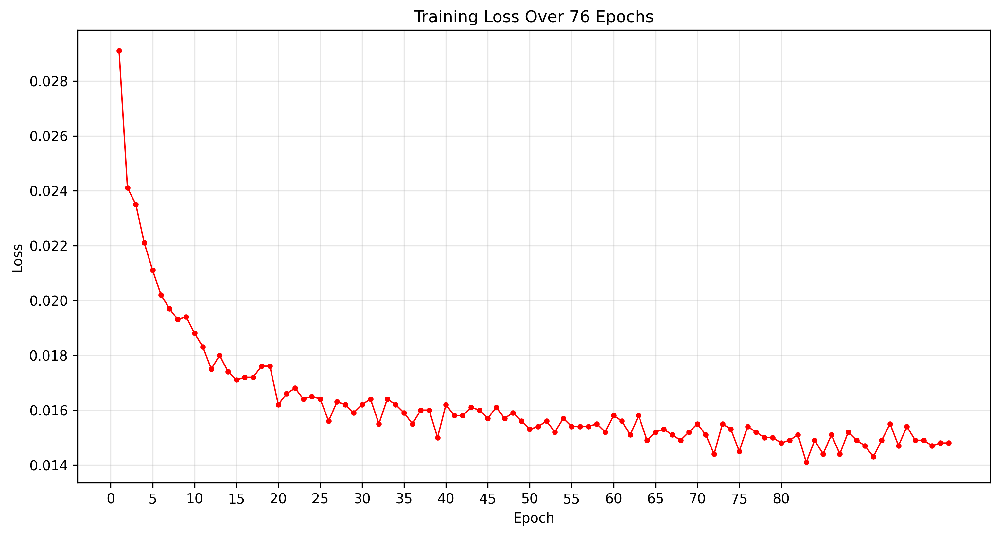
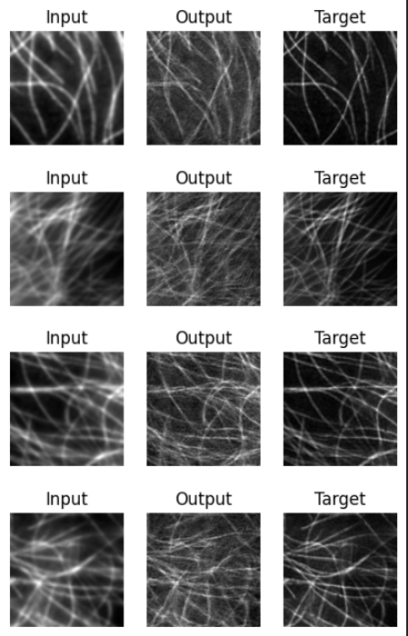

# Diffusion Models to Enhance the Resolution of Microscopy Images

Professional, research-oriented implementation of diffusion-based models to enhance the spatial resolution of microscopy images. This repository contains code to prepare datasets, train a diffusion model, schedule noise, and evaluate super-resolved outputs.

## Project summary

This project implements a pipeline that trains a diffusion model to improve microscopy image resolution (single-image super-resolution). The codebase includes dataset handling, a scheduler implementation, training and evaluation scripts, and example outputs.

Key modules
- `dataset.py` — data loading and preprocessing utilities.
- `Scheduler.py` — noise schedule and scheduler utilities used by the diffusion process.
- `train.py` — training entry point for the model.
- `test.ipynb` — exploratory notebook for quick inference/visual checks.

## Contract (inputs / outputs / success criteria)

- Inputs: low-resolution microscopy images (grayscale or RGB), paired high-resolution references when available.
- Outputs: enhanced (super-resolved) images matching the original image size or a target upsampling factor.
- Success criteria: visually and quantitatively improved resolution (PSNR / SSIM) vs. input LR images and qualitative improvements in fine structures.

## Quick start

1. Create a Python environment (recommend Python 3.8+). Install dependencies listed under "Requirements".
2. Prepare a dataset folder and update any paths in `dataset.py` or configuration used by `train.py`.
3. Run training:

```bash
# from the repository root
python3 train.py
```

4. Use `test.ipynb` to run inference on saved checkpoints and inspect results interactively.

Note: `train.py` accepts configuration via top-of-file variables or command-line arguments depending on your current code. Inspect `train.py` for available options.

## Requirements

- Python 3.8+
- PyTorch (1.8+ recommended)
- torchvision
- numpy, pillow, tqdm

Install example (adjust versions to your environment):

```bash
pip install torch torchvision numpy pillow tqdm
```


## Dataset

This project uses the BioSR dataset (Biological Super-Resolution dataset) — a paired LR/HR microscopy image dataset commonly used for supervised single-image super-resolution research. If you obtained BioSR from its official source, follow the dataset's distribution and citation instructions when publishing results.

Recommended layout for the repository (LR = low-resolution, HR = high-resolution):

```
dataset/
  BioSR/
    train/
      LR/
        img_0001_lr.tif
        img_0002_lr.tif
        ...
      HR/
        img_0001_hr.tif
        img_0002_hr.tif
        ...
    val/
      LR/
      HR/
    test/
      LR/
      HR/
```

Notes:
- The loader in `dataset.py` should be configured to locate the BioSR root (e.g. `dataset/BioSR`) and return paired (lr_image, hr_image) tensors. Common conventions match filenames between LR and HR folders (e.g., `img_0001_lr.png` ↔ `img_0001_hr.png`).
- If your BioSR copy uses a different naming scheme or folder organization, adapt the file-matching logic in `dataset.py` accordingly.
- For licensing and citation, consult the official BioSR distribution; replace this note with the exact citation string from the dataset authors when available.

Additional TIFF notes:
- BioSR commonly ships microscopy images as TIFFs (`.tif` / `.tiff`). TIFFs may contain higher bit depths and metadata compared to PNG; preserve dtype and metadata when loading if possible.
- Prefer `tifffile` or `imageio` to load TIFF images (they handle multi-page and higher bit depths). Example: `tifffile.imread(path)`.
- If BioSR includes multi-page TIFFs, update `dataset.py` to select the correct page or convert to single-frame TIFFs before training.

Customize loader settings in `dataset.py` (image size, normalization, augmentation). The loader should return (lr_image, hr_image) pairs when training with supervision.

## Training

- Configure hyperparameters in `train.py` (batch size, learning rate, number of epochs, checkpoint path).
- The training loop saves model checkpoints and logs training loss. Inspect `train.py` to find the default checkpoint location.
- For reproducible experiments, set random seeds and pin workers in the dataloader.

Recommended hyperparameters (starting point):
- batch_size: 16
- epochs: 100
- optimizer: Adam, lr=2e-4

Edge cases to watch
- Very small datasets will cause overfitting; use augmentations.
- Mismatched LR/HR sizes: ensure the loader returns consistent sizes.
- Out-of-memory: reduce batch size or crop patches instead of full images.

## Evaluation and inference

Use `test.ipynb` or a custom script to load checkpoints and run inference on test images. Typical evaluation metrics include PSNR and SSIM; add metric computation in your evaluation script for quantitative comparison.

## Results

Replace the following image placeholders with your outputs (place images inside the repository `images/` directory or update paths below):

- Training loss curve (example path: `images/training_loss_76_epochs.png`)



- Final results (example path: `images/results.png`) — show input LR | output SR | ground truth HR if available.



To update these images, overwrite the files at the paths above or edit the Markdown to point to the locations you prefer.

## Reproducibility checklist
- Note the exact Python and PyTorch versions used.
- Save a copy of the training configuration and random seed alongside each checkpoint.
- Include small sample of the dataset and a script to run inference on that sample for reviewers.

## Development notes & suggestions

- Add a `requirements.txt` (if missing) to pin versions for collaborators.
- Add a `config.yaml` or CLI arguments to `train.py` to make experiments reproducible and easier to run.
- Add unit tests or a small smoke test that runs a single forward pass on random input to catch obvious breakage.

## License & citation

This repository currently has no license file. Add a `LICENSE` (MIT/Apache/other) if you intend to share the code publicly.

If you use this code in a paper, please cite the project and include details about the trained model and dataset in the paper's methods.

## Contact

Maintainer: repository owner (see repo metadata). For issues and contributions, please open GitHub Issues or Pull Requests in this repo.

---

If you'd like, I can also: generate a minimal `requirements.txt`, add a short example inference script, or insert the actual images into the README with captions — tell me which and I'll add them next.
# Diffusion-Models-to-Enhance-the-Resolution-of-Microscopy-Images
